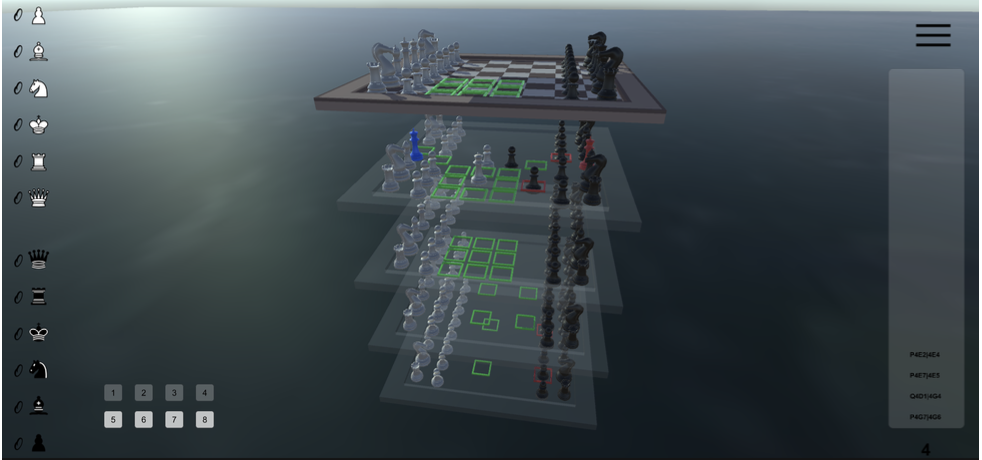
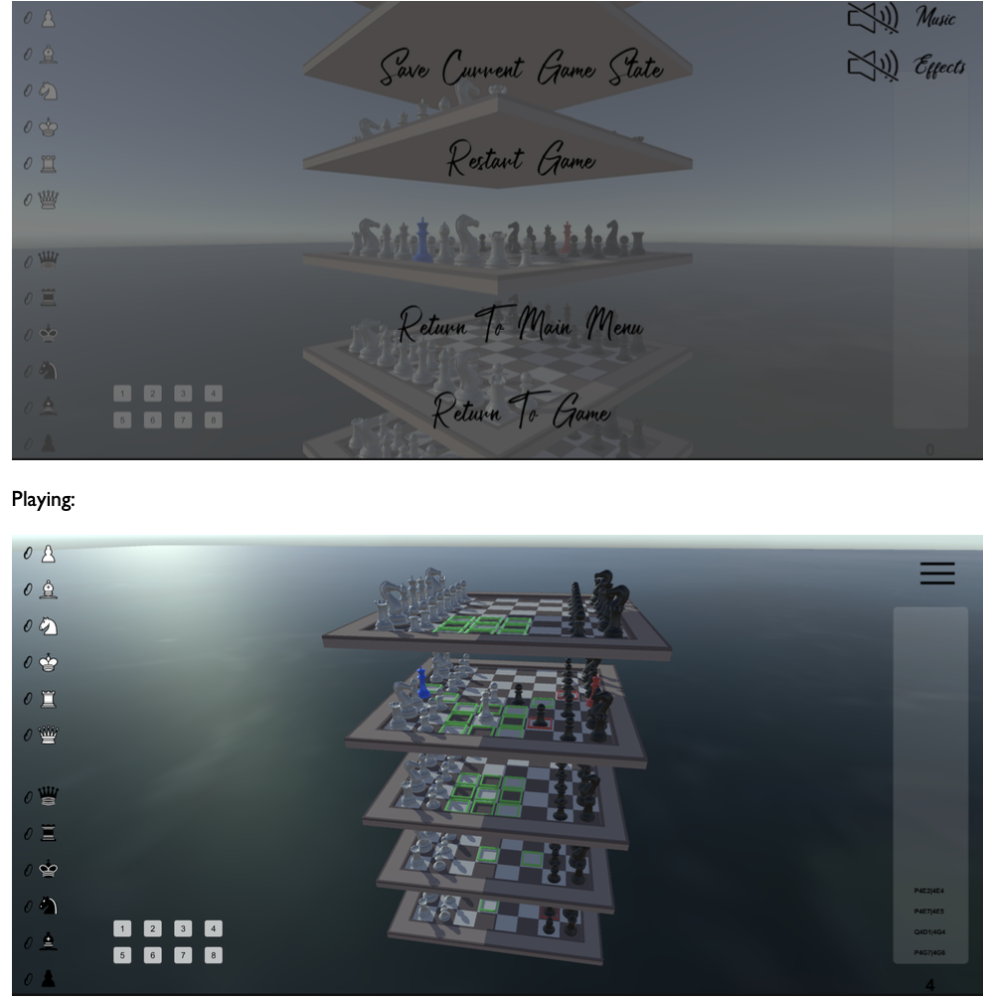

# Engine and AI for chess in 3 dimensions

The first ever way to play 3 dimensional chess on your machine, including an AI making use of NN and mini-max with alpha-beta pruning. 
For a brief overview of what is in the report check [other](#other-).

## Game play videos
Click the links below or find and extensive list of qr codes and links for gameplay, testing and AI.
[The UI](https://drive.google.com/file/d/1P_QHI3i7d4_Z3KJNa_NvEuw3T7rGGZh6/view?usp=sharing)
[The game](https://drive.google.com/file/d/1dlYP3whWLXkN6hpcErFNKTLKL2xOJw8Z/view?usp=sharing)
[AI gameplay: Difficulty 1](https://drive.google.com/file/d/1AviV2v248TPKDxctyYy3FwVjcoFGoMfg/view?usp=sharing)
[AI gameplay: Difficulty 2](https://drive.google.com/file/d/1S9iJMHfFmvPohUn5oZJ6BBWpzO3tqm_n/view?usp=sharing)
[AI gameplay: Difficulty 3](https://drive.google.com/file/d/1xQ-0aF9L2FEhM-wmQHJz7WtWmFXBN3Vb/view?usp=sharing)
[AI gameplay: Difficulty 4](https://drive.google.com/file/d/1RiMu6ynkAT4-griymNg4189O4wqW62l0/view?usp=sharing)
[AI gameplay: Difficulty 5](https://drive.google.com/file/d/1fucjt-9S3sGcmlnqW9m6hUFV8rbZA8dw/view?usp=sharing)
## Screenshots
It is recommended to watch the videos and they give a better view of the game

## Other 
For all other technical information you will find all of these and more in the report:
- Code
- UML diagram
- Flow charts for complicated algos and AI
- Unity environment, configuration and assets
- AI justifications
- Client feedback and interviews
- Research